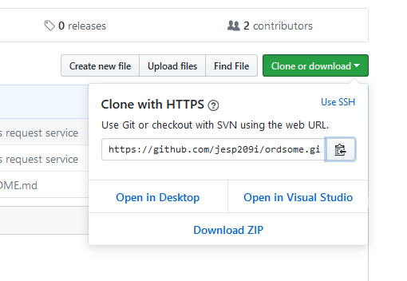
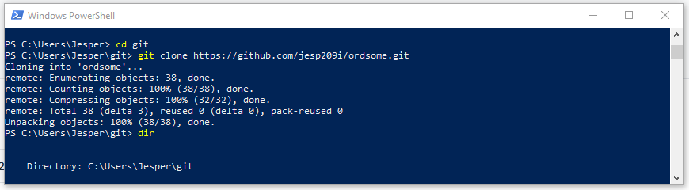
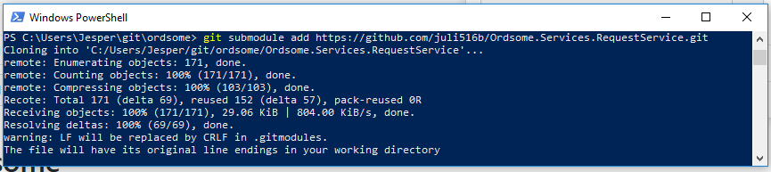

# Fifs til kommandolinje git
Git er et omfattende værktøj og dette er langt fra en guide der forklarer alle aspekter. Branches bliver fuldstændig ignoreret i det efterfølgende, men det kan godt anbefales at sætte sig ind dette aspekt også.

Du ved i forvejen hvordan man navigerer rundt via kommandolinjen  med kommandoer såsom `cd` og `dir`.

Hvis du ikke har git kommandolinjeværktøjet installeret kan det hentes fra [denne side](https://git-scm.com/download/).

Det er vigtigt at værktøjerne til git ligger i din path. Prøv at skrive `git --version` fra en prompt. Hvis du får en fejlmeddelelse så skal du tilføje git til din path.

Vælg et passende sted på din disk hvortil du kan hente git-repos til.
```
eksempelvis
c:\Users\Brugernavn\git
```
Hvis du ikke har undermappen `git` kan du oprette den med kommandoen `mkdir` i powershell eller kommandoprompt.

## klon et repo
Find repoet på github/gitlab eller lign og kopier url'en til `.git` filen.
 

I powershell skriver du:
```
git clone https://github.com/jesp209i/ordsome.git
```

Git sørger for at oprette en mappe til repoet og henter indholdet ned.

## Status, add, remove, commit og push
Før du kan committe skal du fortælle git hvilke ændringer du gemme.

Kommandoen `git status` viser dig hvilke filer der er ændringer i, og om de bliver committet eller ej hvis du laver et commit.

Med kommandoen `git add *` kan du tilføje alle filer. Men man kan sagtens nøjes med at vælge enkelte ud `git add filnavn`.
Med `git remove filnavn` vælger man at smide en ændring væk. 

Kommandoen `git commit -am 'commitbesked` bruges til at lave et commit. 
> Husk at skrive en fornuftig commitbesked!!!!!

Og endelig bruger man `git push origin master` til at skubbe sine commits tilbage op på serveren (til master-branchen).

## Pull
Når du første har clonet et repo, behøver du ikke gøre det mere. du kan blot navigere til den mappe repoet bor i, og skrive:
```
git pull
```
Git skriver "Already up to date", hvis der ikke er nogle ændringer at hente.

## Tilføj et submodule til et repo
Et submodule er bare et andet repo. Det betyder at det overordnede repo også pejer på et eksternt repo.

I kommandolinjen skal du befinde dig i det overordnede repos 'øverste' mappe. Du har også fundet frem til det andet repos `.git`-url.

I kommandolinjen skriver du:
```
git submodule add https://github.com/juli516b/Ordsome.Services.RequestService.git
```

Nu har du lokalt hentet til seneste commit fra submodulet.

Du skal committe din lokale ændring:
```
git commit -am 'skriv en sigende commit-besked'
```
og nu kan du pushe tilbage op til github eller hvor dit repo ligger:

```
git push origin master
```
> __Bemærk:__ Rent teknisk i git pejer du kun på det seneste commit. Det betyder at når ejeren af repoet, som du har lavet til en submodul, laver yderligere commits, så pejer du stadig på det samme og får ikke automatisk de nyeste ting med.

## Opdater submodule 
Gå ind i det overordnede repo. Skriv `git pull`, så du henter det seneste online.

Derefter navigerer du ind i mappen for submodulet. Her skriver du også `git pull`.

Nu navigerer du op til samme niveau som det overordnede repo.

Hvis din eneste ændring er, at du har hentet det seneste submodule, kan du skrive: 
```
git add *
git commit -am 'commit besked'
git push origin master
```
 
# Yderligere læsning om git
- https://git-scm.com/book/en/v2
