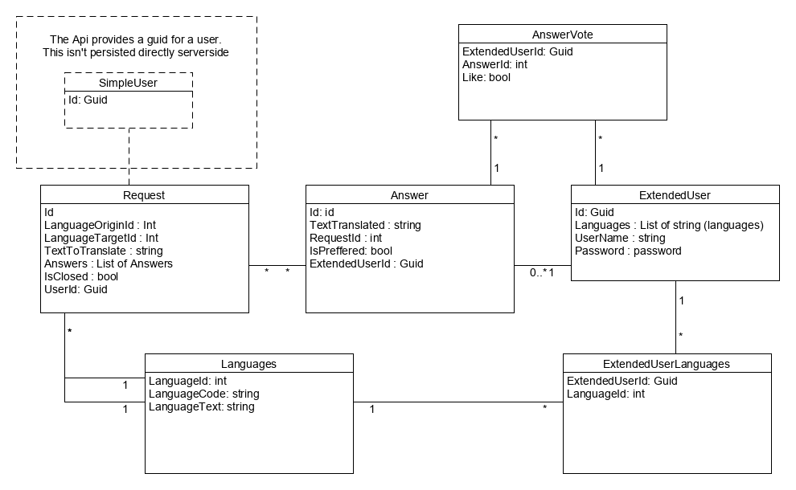

# Usecases

| Prioritet | UC code | UC titel | Beskrivelse |
|---|---|---|---|
| 2 | UC-A4 | Luk og godkend Oversættelse | “Turisten” har modtaget et svar han er glad for. Dette angives på svares og systemet lukker anmodningen. (Anmodningen sendes ikke ikke længere til oversættere) |
| 3 | UC-A5 | Luk oversættelse, uden godkend | “Turisten” skal ikke bruge anmodningen alligevel, og angiver at han vil lukke anmodningen. (Anmodningen sendes ikke længere til oversættere - og ingen godkendt oversættelse) |
| 4 | UC-AB1 | Bruger omdannes til oversætter | En bruges angiver hvilket/hvilke sprog hvor han kan hjælpe med at oversætte. |

# Model

## Api requests
### User service
- [Get] api/users/new

  Api generates a Guid for the client to use. This guid qualifies this client to be a "base user".
  
- [Post] api/users/register

  Endpoint: post credentials to upgrade "base user" to "extended user"
  
- [Post / delete] api/users/{userId}/language

  Endpoint: register the languages of the "extended user".

### closing requests
- [Patch] api/requests/{id}/close

  a user who made a request can close the request 

### selecting preffered answer
- [patch] api/requests/{id}/answer/{answerId}/preffered

  a user who made a request can chose an answer he prefers

### vote on answer
- [Post] api/requests/{id}/answer/{answerId}/vote

  an "Extended user" can vote on one of the answers already supplied. (Logic: but not one of his own)
